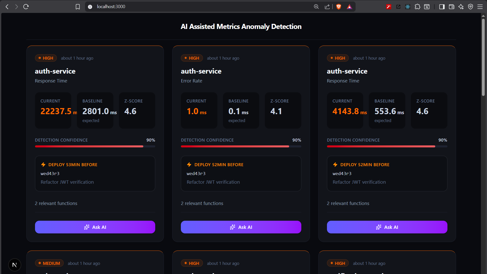
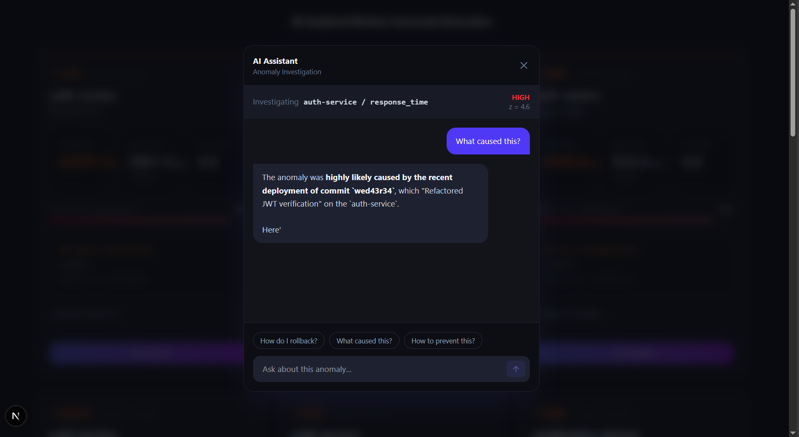

# AI-Assisted Metrics Anomaly Detection

This project provides an intelligent, AI-assisted platform to detect and investigate anomalies in infrastructure and application metrics.

## Web Application
[Live Web Application URL](https://metrics-anomaly-detection.vercel.app/)

## Screenshots & Demo Video

**Screenshot 1:**   
**Screenshot 2:**   

## Architecture Overview

The application includes frontend client, backend service, and AI intelligence processing layer.

- **Frontend (Client)**: Built with Next.js, React, Tailwind CSS, and Lucide Icons. Provides a responsive and interactive dashboard where developers can view anomalies.
- **Backend (Server)**: A Node.js and Express backend built with TypeScript. It ingeps mock metrics, deployment data, and codebase mapping (CodeMap).
- **Data Layer (MongoDB)**: Stores real-time metrics, anomaly events, deployments, and codebase structure (CodeMaps).
- **Intelligence Layer (Google Gemini)**: Receives the context of any detected anomaly (z-score, baseline, metric name, and related source functions) and generates a human-readable explanation and suggested remediation based on the specific lines of code.

##  Anomaly Detection Approach

Metrics (such as Error Rate, Response Time) are continuously monitored via sliding windows.

1. **Rolling Baseline Calculation**: The backend determines a rolling average and standard deviation (variance) for metrics.
2. **Z-Score Spike Detection**: Incoming metrics are evaluated against the current baseline. If a metric breaches a Z-score threshold (e.g., `z > 3`) over a sustained number of data points (e.g : 5), it triggers an anomaly.
3. **Score Calculation**: Anomalies are given a confidence score determined by the magnitude of the spike and its temporal proximity to recent code deployments.
4. **Severity Assignment**: Based on the absolute Z-Score deviation (`>6 = Critical`, `>4 = High`, `>3 = Medium`), the anomaly is assigned with a severity level.

---

##  How Metrics are Linked to Code

The core of the anomaly detection engine relies on **CodeMaps**.
1. **Service Registration**: Services map their key functions to specific metrics. (e.g., `response_time` might be linked to `verifyToken` in `src/services/jwt.service.ts`).
2. **Deployment Correlation**: When an anomaly is detected, the system looks backwards to find the most recent deployment belonging to the compromised service.
3. **Context Construction**: The anomaly document binds the anomalous metric values with the time since the last deploy, and links them to the exact `keyFunctions` associated with that metric.

---

##  How the AI Reasoning Works

Once an anomaly is detected and contextualized with code metadata:
1. **Prompt Construction**: The server constructs a prompt comprising the metric context (value, baseline deviation), the deployment commit message, and the functions potentially causing the issue.
2. **LLM Querying (Gemini)**: The AI engine queries the Gemini model with the prompt.
3. **Resolution generation**: The AI returns a structured JSON payload containing a deep-dive explanation and step-by-step recommendations to resolve the issue.

## Mock Data & Anomaly Simulation Strategy

To simulate a realistic production environment and validate the anomaly detection pipeline, the system programmatically generates deployments and historical metrics with controlled degradations.

1. **Simulated Deployments** : The application creates recent deployment records i.e
auth-service deployed 20 minutes ago, notification-service deployed 40 minutes ago.
These timestamps are later used to correlate detected anomalies with recent code changes.

2. **Historical Metrics** : The system generates 2 hours of time-series data at 15-second intervals for each service and metric i.e response_time and error_rate. For most of the time window metrics remain within healthy ranges small random variance simulates natural system noise. This establishes a stable rolling statistical baseline

3. **Controlled Post-Deployment Degradation** :  To trigger anomaly detection, the system introduces intentional metric degradation shortly after deployment (e.g., 5–10 minutes post-deploy). Metric values increase using a bounded exponential multiplier:
Math.pow(1.4, Math.min(timeSinceSpike, 15)). This creates a realistic performance regression leads to Response time increases significantly and error rate rises progressively
The rolling baseline is statistically violated

4. **Why Anomalies Are Detected** : The anomaly engine calculates rolling mean and standard deviation Computes Z-scores for incoming values. Flags sustained deviations beyond threshold. Correlates anomalies with recent deployments using time proximity. This approach produces deterministic, reproducible anomalies that demonstrate Statistical detection, Deployment correlation, Code ownership mapping and 
Confidence scoring.

## Sample Scenario

### Example Metrics
- **Service**: `auth-service`
- **Metric**: `response_time`
- **Rolling Baseline**: `72ms`
- **Anomalous Value**: `268ms` (Z-Score: +4.8)
- **Deployment**: `Refactor JWT verification` (20 mins ago)

###  Detected Anomaly
A sustained spike in `response_time` for the `auth-service`. The anomaly engine flags this as a **High Severity** event due to the significant deviation from the historic norm.

### AI Explanation

### Suggested Fix
